# Material Manager Extended
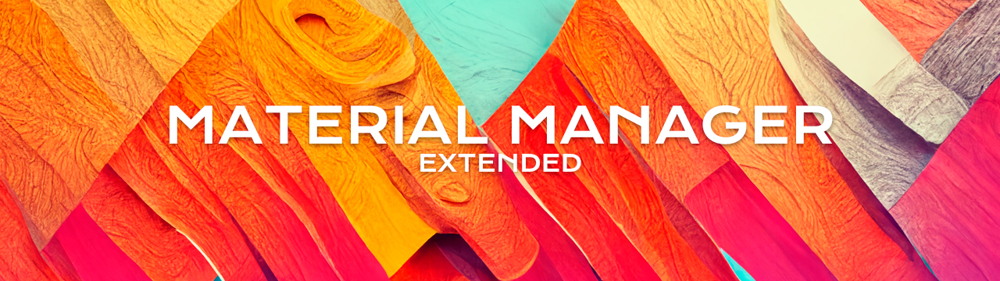
### About
This extension will let you quickly toggle between different materials for the static objects in your scene.

## Quick links

* [Installation](#installation)
* [Restrictions](#restrictions)
* [How to use](#how-to-use)
* [Linking with an Omniverse app](#linking-with-an-omniverse-app)
* [Contributing](#contributing)
* [Changelog](CHANGELOG.md)

## Installation

To add a this extension to your Omniverse app:
1. Go into: Extension Manager -> Gear Icon -> Extension Search Path
2. Add this as a search path: `git://github.com/Vadim-Karpenko/omniverse-material-manager-extended?branch=main&dir=exts`
3. A new window should appear alongside the Property tab:


    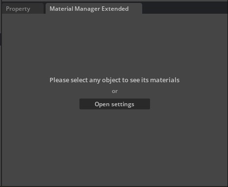

## Restrictions
1. It will not work with the primitives (because they don't have the required structure by default, see below for more) and may not work with characters (would appreciate someone to test it). Vegetation can also cause problems, but most should work just fine.
2. Your object needs to have the following structure:


    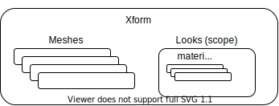


    Most objects already have this structure, especially from **Nvidia Assets** tab, but in some custom cases, you might need to change your object so it corresponds to the structure from above. Note: Looks folder can be empty, and your original textures located somewhere else, it just tells the extension that this is a separate object.
    #### Example:


    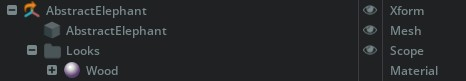


## How to use
- Navigate to your viewport and select any static object on your scene
- Once an object is selected and is valid (see restrictions), the window will be changed into something similar to this:


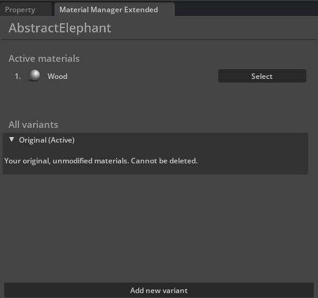
- Click **Add new variant** at the bottom of the window. A new variant called _Look_1_ will appear in the list. You can create as many as you need, and if you need to rename your variant you can do it by renaming appropriate folder in **Looks/MME/your_variant**


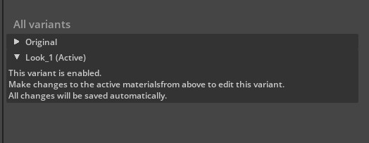
- You will see a viewport window on top of your model. Change material or replace it completely while your variant is active


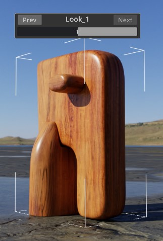 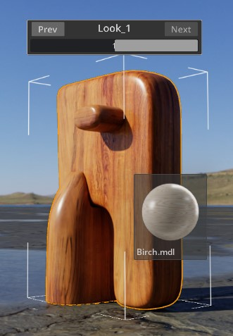


- Now you can toggle between those variants


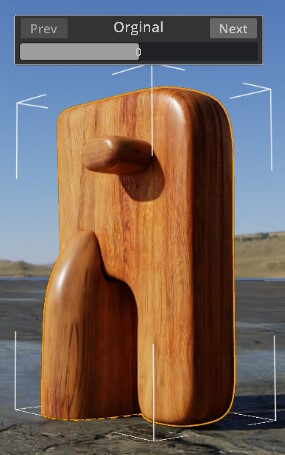 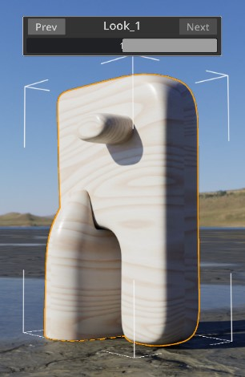


- More complex Xform's are also supported. This means that the extension will toggle all the materials for every mesh at once under this Xform.


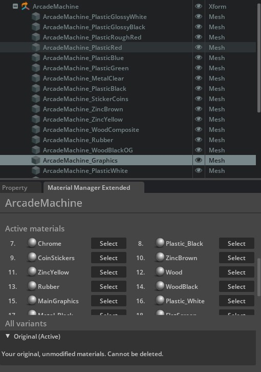

## Linking with an Omniverse app

For a better developer experience, it is recommended to create a folder link named `app` to the *Omniverse Kit* app installed from *Omniverse Launcher*. A convenience script to use is included.

Run:

```bash
> link_app.bat
```

There is also an analogous `link_app.sh` for Linux. If successful you should see `app` folder link in the root of this repo.

If multiple Omniverse apps is installed script will select recommended one. Or you can explicitly pass an app:

```bash
> link_app.bat --app code
```

You can also just pass a path to create link to:

```bash
> link_app.bat --path "C:/Users/bob/AppData/Local/ov/pkg/create-2022.1.3"
```


## Contributing
Feel free to create a new issue if you run into any problems. Pull requests are welcomed.
